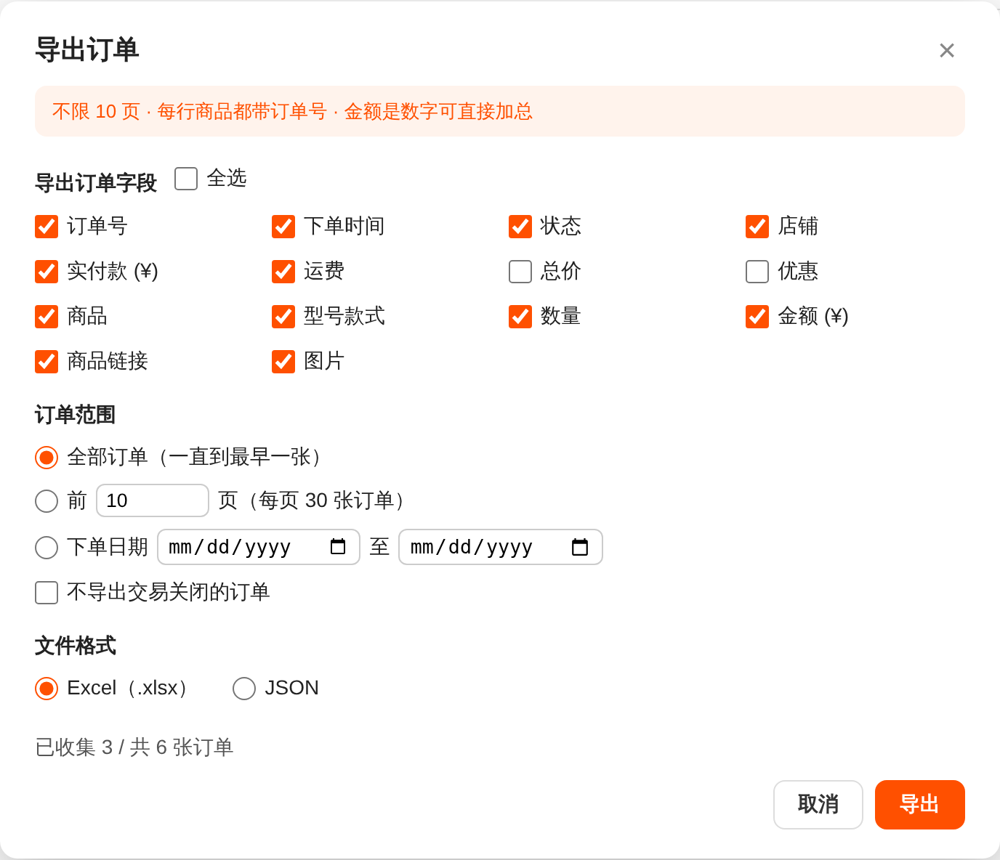
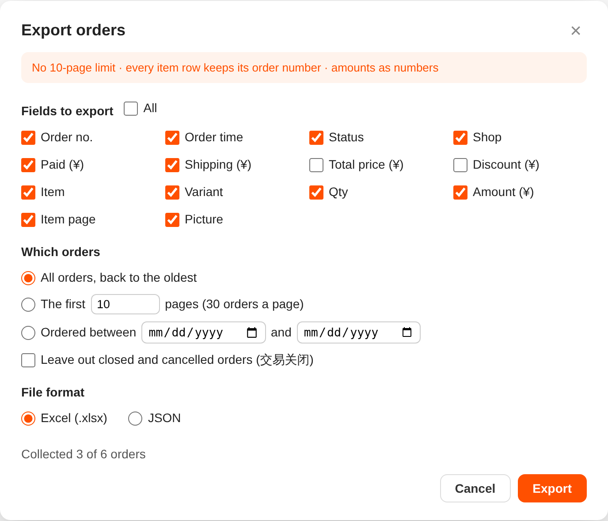
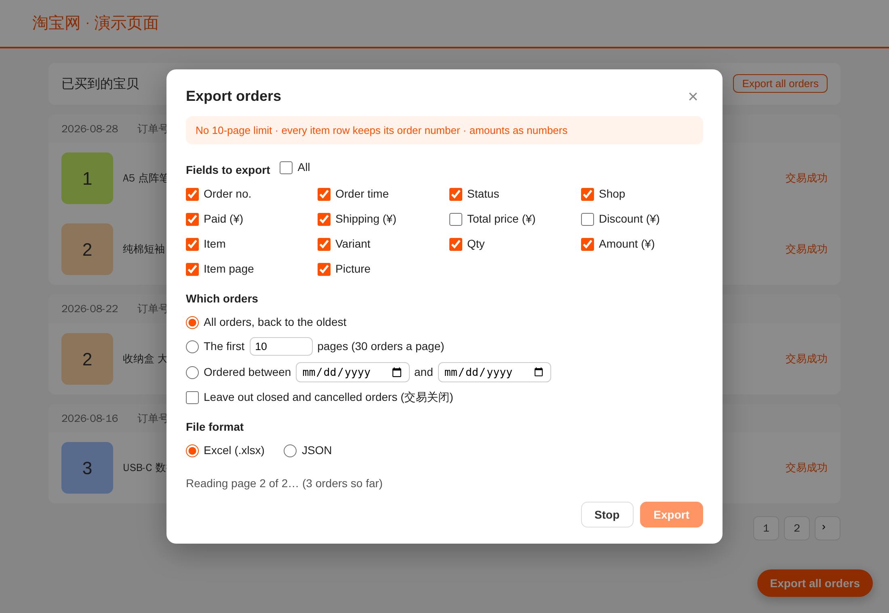

<div align="center">


# 淘宝订单导出（Order Exporter for Taobao）

**在浏览器里，把淘宝「已买到的宝贝」的全部订单导出成 Excel、CSV 或 JSON。**


[English](../../README.md) · [繁體中文](README.zh-TW.md) · **简体中文** · [日本語](README.ja.md) · [한국어](README.ko.md) · [Español](README.es.md)

</div>

<p align="center">
  
</p>
<p align="center">
  
  &nbsp;
  
</p>

<details>
<summary>更多截图</summary>

<p align="center"></p>

截图全部使用虚构的演示订单。

</details>

## ✨ 功能

- 📦 **全部订单**，一直到最早的那一张。淘宝自带的「导出订单」每次最多 10 页。
- 📅 **选择范围**：全部订单、前 *N* 页，或某段日期内下的单；也可以不导出交易关闭的订单。
- ☑️ **像淘宝的窗口一样勾选字段**：订单号、时间、状态、店铺、实付款、运费、总价、优惠、商品、型号款式、数量、金额、商品链接、图片。
- 📊 **Excel（.xlsx）、CSV 或 JSON。** Excel 里每行商品都带订单号，金额是数字，另有一张「订单」表，加总不会重复计算。
- 🔒 **只在本地运行。** 不用账号、没有服务器、没有追踪，只读取淘宝页面本身已加载的数据。
- 🌐 **界面支持英文、简体中文、繁體中文**，跟随浏览器语言。

## 📥 安装

> [!NOTE]
> 扩展还没有上架 Chrome 应用商店，暂时请用 Release 里的 zip 安装。

1. 从[最新 Release](https://github.com/HKmario852/Taobao-Order-Export/releases/latest) 下载 `taobao-order-export-<版本>.zip` 并解压。
2. 打开 `chrome://extensions`（Edge：`edge://extensions`，Brave：`brave://extensions`）。
3. 开启「开发者模式」，点「加载已解压的扩展程序」，选择包含 `manifest.json` 的文件夹。

请保留这个文件夹，浏览器是从这里加载扩展的。要更新时换成新的文件夹，再在扩展上点 ↻。

## 🚀 使用方法

1. 登录淘宝，打开「我的淘宝 › 已买到的宝贝」。
2. 点「导出全部订单」（在淘宝「导出订单」旁边，或右下角）。
3. 选好字段、订单范围和文件格式，点「导出」。

扩展会自己点「下一页」，每页约 2–4 秒（每页 30 张订单），读完后下载 `taobao-orders-<日期>.xlsx` 或 `.json`。
如果中途淘宝要求滑动验证，完成后点「继续」。点「停止」可以提前结束。

| | 淘宝「导出订单」 | 本扩展 |
| --- | --- | --- |
| 每次导出多少 | 最多 10 页 | 全部、前 *N* 页或日期范围 |
| 格式 | Excel | Excel、CSV 或 JSON |
| 同一订单的第 2 件以后 | 订单号、时间、店铺留空 | 每行都有 |
| 金额 | 像 `￥26.80` 这样的文字 | 数字 |
| 图片链接 | 没有 | 有 |

文件格式（Excel 工作表和 JSON 结构）见 [docs/DEVELOPMENT.md](../DEVELOPMENT.md#output-files)（英文）。

## 🛠️ 从源码构建

```bash
git clone https://github.com/HKmario852/Taobao-Order-Export.git
cd Taobao-Order-Export
node --test test/*.test.js          # Node 18 及以上
zip -r taobao-order-export.zip manifest.json *.js _locales icons   # 打包上架用
```

不需要编译。每次 push 到 `main`，**Actions** 也会生成一个可直接上架的 zip。工作原理、重新生成截图和新增语言，见 [docs/DEVELOPMENT.md](../DEVELOPMENT.md)。

**技术栈：** 纯 JavaScript、Chrome Manifest V3、内置的小型 `.xlsx` 生成器、`node:test`。Playwright 只用来截图。

## 🔐 隐私

扩展本身不发出任何网络请求，也没有统计分析。导出窗口的选择保存在淘宝页面的 local storage；订单数据只留在打开的标签页里，直到你下载。它不会导出地址、电话或收件人姓名。详见 [PRIVACY.md](../../PRIVACY.md)（英文）。

## ⚠️ 免责声明

本扩展与淘宝、阿里巴巴无关。它读取的是淘宝页面自己加载的数据（未公开、没有文档的内部接口返回），淘宝改版后可能失效，直到扩展更新。运费、总价、优惠只在淘宝提供时才会导出；物流单号不会导出。

## 📄 许可证

[MIT](../../LICENSE) © HKmario852
